# PinePaper MCP Server

> Create animated vector graphics with AI using the Model Context Protocol

[](https://www.npmjs.com/package/@pinepaper.studio/mcp-server)
[](https://opensource.org/licenses/MIT)

**English** · [简体中文](README.zh-CN.md) · [日本語](README.ja.md) · [한국어](README.ko.md) · [Español](README.es.md) · [Português (BR)](README.pt-BR.md) · [Français](README.fr.md) · [Deutsch](README.de.md) · [हिन्दी](README.hi.md)

<p align="center">
  
</p>

<p align="center">
  <b>The animation engine agents can drive.</b><br>
  This poster is one 16&nbsp;KB SVG — 100+ animations, no scripts. View source on it.<br><br>
  <a href="https://pinepaper.studio/?utm_source=github&utm_medium=readme&utm_campaign=launch_pinned&utm_content=hero">Try PinePaper Studio</a> ·
  <a href="https://pinepaper.studio/docs?utm_source=github&utm_medium=readme&utm_campaign=launch_pinned&utm_content=docs">Docs</a> ·
  <a href="https://www.npmjs.com/package/@pinepaper.studio/mcp-server">npm</a>
</p>

*Everything above and below moves — these are animated SVGs exported straight from PinePaper tool calls, no video files, no GIFs. Open this README on GitHub and watch.*

## Overview

PinePaper MCP Server enables AI assistants to create and animate graphics in [PinePaper Studio](https://pinepaper.studio) via the Model Context Protocol (MCP). Works with any AI that supports MCP tool calling (Claude, GPT, Gemini, local models, etc.).

The server exposes **144 tools** across drawing, animation, diagrams, maps, typography, physics, image editing, data visualization, and export. Using natural language, you can:

- Create text, shapes, geometry, and complex graphics
- Animate items with behavior-driven **relations** rather than keyframes
- Build long scenes as **event-driven chains** that stay scrub- and replay-stable
- Generate procedural backgrounds and parametric/equation-driven paths
- Author diagrams, maps, charts, and letter collages
- Edit images: crop, chroma-key background removal, GPU filters, lasso cutouts, object detection
- Export animated SVG, video frames, embeddable widgets, and LLM training data

## Running it: local or hosted

**Local is free and complete.** Every one of the 144 tools works when you run
this server yourself. There is no reduced tier and nothing held back.

What it needs:

| | |
|---|---|
| Node | 18 or newer |
| Disk | Puppeteer downloads Chrome on install — roughly **320 MB** per version |
| Memory | a Chrome process plus the Studio canvas, so budget ~1 GB while a job runs |

That is fine on a laptop and awkward on a small VPS, a locked-down work machine,
or a container you would rather keep thin.

**[cloud.pinepaper.studio](https://cloud.pinepaper.studio) runs the same server
for you** — same tools, same version, over HTTP with no install and no browser
on your machine. It exists for three cases: you have no MCP client, you cannot
install one, or your machine cannot spare the browser.

Hosting costs money, so the hosted option is paid — but there is no
subscription and no plan to pick. You buy credits, they never expire, and you
are charged per operation; your first top-up includes $1 of credit free.
Current rates are on [cloud.pinepaper.studio](https://cloud.pinepaper.studio). If you can run it
locally, run it locally — you lose nothing by doing so.

## Made with tool calls

<p align="center"></p>

Every graphic below is an animated SVG produced through this server's tool surface — the arguments shown with each result are what an AI agent passes to the named tool. They aren't shell commands; **[Run these yourself](#run-these-yourself)** below shows the three ways to execute them.

<!-- Stacked (image then code) rather than a two-column table so the SVGs render on
     mobile — GitHub keeps HTML tables two-column on narrow screens, which squeezes
     the image column to nothing. -->

<p align="center"></p>

```js
// The scene IS a graph: two items, two declared edges —
// the canvas view and the graph view are the same data.
{ "sourceId": "$dot",
  "relationType": "moves_along_path",
  "relationOptions": { "path": "$p1",   // an ellipse path
    "duration": 6, "easing": "easeInOut", "loop": true } }
{ "itemId": "$square", "animationType": "rotate",
  "options": { "speed": 0.18 } }
```

<p align="center"></p>

```js
// Five rails, five named easings, one loop — each dot is
// a moves_along_path down its rail with a different easing
for (const easing of ['linear', 'easeIn', 'easeOut',
                      'easeInOut', 'pingpong']) {
  add_relation($dot, 'moves_along_path', {
    equation: { kind: 'parametric', xExpr: '0', yExpr: 't',
                min: -1, max: 1, scale: 58 },
    duration: 2.6, easing, loop: true });
}
```

<p align="center"></p>

```js
// The engine solves the curve; the exporter bakes the
// motion to native SVG keyframes. pinepaper_add_relation:
{ "sourceId": "$dot", "relationType": "moves_along_path",
  "relationOptions": { "equation": {
    "kind": "parametric",
    "xExpr": "cos(2*t)*cos(t)",
    "yExpr": "cos(2*t)*sin(t)",
    "scale": 108, "cx": 280, "cy": 118 },
    "duration": 8, "loop": true } }
```

<p align="center"></p>

```js
// Status chip: pale panel, slate bar, green dot blinking
{ "itemType": "rectangle", "properties": { "width": 264,
  "height": 72, "fillColor": "#e8eff5" } }
{ "itemType": "circle", "properties": { "radius": 9,
  "fillColor": "#2e9b4e" } }
{ "itemId": "$1", "animationType": "fade",
  "options": { "speed": 1.0 } }   // only the dot blinks
```

All five showcase files (including the banner) live in [`assets/`](assets/) — tiny (4–11 KB), dependency-free, loop forever, and render anywhere SVG renders: GitHub READMEs, docs sites, dashboards, emails that allow SVG. They follow one editorial design system (serif mastheads, hairline rules, slate ink on paper white, framed canvas stages, typed-edge graph diagrams) supplied to the agent as context — share a design guideline with your agent and the tool calls come out on-system.

### Try it interactive

GitHub can't run scripts inside a README, so the interactive demos live in the editor — one click, no install. Each is a shipped template where the **relation graph** does all the state handling (tabs, accordions, menus — no event-handler code):

- [Tabs from relations](https://pinepaper.studio/editor.html?template=tabs-from-relations) — `on_click_fire` + `exclusive_group` + `on_enter_set_visibility`
- [Accordion from relations](https://pinepaper.studio/editor.html?template=accordion-from-relations) — disclosure pairs via `on_event_toggle`
- [Solar system, 4-in-1 tabs](https://pinepaper.studio/editor.html?template=solar-system-tabs) — the state machine driving four scenes
- [Menubar from relations](https://pinepaper.studio/editor.html?template=menubar-from-relations) — WAI-ARIA menubar semantics from the same graph

The same graph drives visuals, keyboard access, and screen-reader roles (WCAG 2.1 AA) — see `pinepaper://docs/relations` from your MCP client.

## Run these yourself

The snippets above are MCP tool-call arguments — they execute when an AI agent invokes the tool. Three ways to make that happen:

**1 · Ask your agent (any MCP client).** With this server [configured](#2-configure-your-ai-client), paste a prompt like:

> Create a blue circle and make it ride a diamond-shaped path with easeInOut, looping. Add an orange rotating square beside it. Then export the scene as animated SVG.

Your agent picks the tools (`pinepaper_create_item`, `pinepaper_add_relation`, `pinepaper_export_svg`) and runs them.

**2 · Hand your agent a complete batch.** This is a full, valid `pinepaper_agent_batch_execute` argument — an agent (or an MCP inspector) can execute it verbatim; `$0`/`$1` reference the created items in order:

```json
{
  "operations": [
    { "type": "create", "itemType": "circle",
      "properties": { "x": 300, "y": 260, "radius": 10, "fillColor": "#2e5e8f" } },
    { "type": "relation", "relationType": "moves_along_path", "sourceId": "$0",
      "relationOptions": { "path": [ { "x": 180, "y": 260 }, { "x": 300, "y": 180 },
                                     { "x": 420, "y": 260 }, { "x": 300, "y": 340 } ],
                           "duration": 6, "easing": "easeInOut", "loop": true } },
    { "type": "create", "itemType": "rectangle",
      "properties": { "x": 520, "y": 260, "width": 60, "height": 60, "fillColor": "#f0a030" } },
    { "type": "animate", "itemId": "$1", "animationType": "rotate" }
  ]
}
```

**3 · No MCP, no agent — just a browser.** Open [pinepaper.studio/editor](https://pinepaper.studio/editor.html), open the browser console, and paste (verified working as-is):

```js
const app = window.PinePaper;
const dot = app.create('circle', { x: 300, y: 260, radius: 10, fillColor: '#2e5e8f' });
app.addRelation(dot.data.id, null, 'moves_along_path', {
  path: [ {x:180,y:260}, {x:300,y:180}, {x:420,y:260}, {x:300,y:340} ],
  duration: 6, easing: 'easeInOut', loop: true,
});
const sq = app.create('rectangle', { x: 520, y: 260, width: 60, height: 60, fillColor: '#f0a030' });
app.animate(sq, { animationType: 'rotate' });
```

The same code an agent generates is the code you can paste — the canvas is yours either way, undo included.

## What's new in 1.6.7

**Four more item-stage shader effects** — `electric_arc`, `vortex`, `rain_veil`, `caustics` (ABYSSAL's noise library). The `item` shader stage went from four built-ins to eight and nothing here named the new half.

**`on_key_fire` now matches a chord exactly.** Its modifier tests were one-way — they required a modifier that was asked for but never rejected one that was not — so `{ key: 'Enter' }` fired on Ctrl+Enter, Shift+Enter and Cmd+Enter alike, and `{ key: 's' }` fired on the browser's own Ctrl+S. Those are different intents. The relation's documentation says so now, along with the focus gate that keeps it from taking keys from the rest of the page. (Reported from this repo during the relation audit; fixed engine-side.)

**Three appliers that failed in silence now report.** The engine's `animate`, `applyAnimatedMask` and `applyCutoutStyle` refused an unknown key only through `console.warn`, and the production build strips the console — while returning values identical between success and failure (`undefined` either way, a Paper Group either way, and the very item it was given). Over MCP, where there is no console to read, an unknown key left the canvas unchanged and told every caller it had worked.

The engine now records the refusal on the item it already hands back, and these tools read it: a refused animation type, a mask that applied but will never animate, and a cutout preset that returned the item untouched are all reported as failures, each carrying the requested value **and the known list**, so a caller can correct itself without a second round trip.

**New tool: `pinepaper_character`** — place a figure from the graph and direct it. The character layer was reachable from the cloud's build script and nowhere else, which by this project's own rule means it did not exist: an MCP client, a cloud caller and a small on-device model all see these schemas and nothing behind them.

- It replaces roughly thirty exactly-right calls — create the skeleton, add each bone with the right parent and angle, create each shape, attach each to the right bone, then author poses — where one mistake anywhere leaves a broken figure. That volume of exactly-right output is the reported reason characters do not work for smaller models.
- Direction is declarative beats: `{ concept: "pp:Pigeon", at: {...}, height: 300, beats: [{ at: 0, channel: "bob", until: 8 }, { at: 1.4, channel: "blink" }] }`.

**`create_item` gains `shader` and `field` item types.** The cloud renderer has drawn shaders and parametric fields for months, reachable only by hand-writing a scene document — so the capability existed for whoever writes the build script and for nobody else.

- The description names the parameters and the expression variables a field is written in: a parameter nobody can discover is the same as a parameter that is not there.
- `bornAt`/`ttl` are documented on `properties`. They always passed through (`properties` is a free record) and nothing mentioned them, so no caller could build a piece that cuts between shots — which is why the only multi-shot pieces that exist had their shots inferred from a naming convention in a build script.
- **A surface is not a shape**, and the ontology now says so instead of filing these under Path because they also end up as pixels: `pp:CanvasSurface`, with `pp:ShaderSurface` and `pp:ParametricField` under it. A shape is built as an item and drawn from its geometry; a surface is evaluated as the frame is drawn.


**New tool: `pinepaper_import_motion_capture`** — BVH import and retarget. The engine has had `importBVH`/`retargetBVH` for releases and nothing exposed them; a model cannot use a capability no tool call reaches.

- `mode: 'import'` builds a new skeleton shaped like the capture file. `mode: 'retarget'` drives an **existing** rig, so proportions stay the character's and only the motion comes from the clip — that distinction is the reason the tool exists.
- Angles transfer as bind-pose deltas, so a T-posed CMU rest is not slammed onto a rig with a relaxed stance. Bones the alias table cannot place come back as `unmatchedSource`/`unmatchedTarget` instead of silently driving half a rig, so a caller can build `boneMap` from the failure. `fps` defaults to 15 — CMU records at 120, and nobody wants 120 poses a second on a canvas timeline.

**`pinepaper_rigging` gains the pose-motion half — 18 actions.** The engine had 26 pose methods; the tool exposed two. The pose library (`list_poses`, `load_pose`, `interpolate_poses`, `list_skeletons`), playback (`play_pose_sequence`, `stop_pose_sequence`, `apply_pose_transition`), procedural layers (`auto_walk`, `auto_breath`, `auto_idle`, `auto_jump`), root locomotion (`move_root`, `stop_root_track`), and the export/deform edges (`bake_animation`, `add_secondary_motion`, `skin_path`, `list_shape_keys`, `load_shape_key`). Each was checked against the engine source rather than its docs, which name tools that were never registered.

- **New capability: `stitch_poses`** — join clips into one continuous performance, entering a cyclic clip at the phase closest to where the previous one ended so the legs do not teleport mid-stride.

**New tool: `pinepaper_design_medium`** — the third design axis: what physically makes the marks. Every medium declares a *fidelity*, and `resolve` refuses the ones it cannot honestly render rather than producing flat shapes in their colours. `apply_thread` renders an item as needlepainting; the direction field is what separates that from hatching.

**New tool: `pinepaper_text_effect`** — 37 character-level text animations (terminaltexteffects' vocabulary, reimplemented in the engine from source). `list` returns the effects; `apply` explodes a text item into one animated item per character.

- The planner is pure and emits **keyframes**, so the result is ordinary animated items: it scrubs on the timeline, survives undo and session restore, and exports through the existing MP4 / SMIL / Lottie paths. Every effect ends at rest.
- **It replaces the text item.** Unlike `pinepaper_text_style` (which adopts the text's registry id), this removes the original and returns the new per-character ids — so relations and keyframes on the source id do not survive. `keepSource: true` is the escape hatch. The tool is marked `destructiveHint` and says so in its description, because it inverts the id-preservation convention every neighbouring tool follows.
- Resting characters are painted with a gradient across the text block by default (what the upstream effects actually do); `gradient: false` keeps the authored fill. `seed` defaults to 1, so a given text + effect + seed animates identically every run.

**Two more enums that named things the engine does not have.** Both were the same shape as the relation gap, found by diffing every validated enum against the engine rather than by anything failing.

- **`canvasPreset` on the agent-flow tools** passed an export *platform* name (`instagram`, `youtube`, `web`) straight to `setCanvasSize`, which keys on `instagram-post` and `full-hd-1080p`. Seven of ten matched nothing: the engine fell through to its default, resized the artboard to 800×600, and recorded the preset as applied — so asking for an Instagram canvas got neither the size nor an error. Now mapped, and pinned by a test against the engine's preset list. The platform vocabulary is unchanged, because `instagram` is the right word for an export target and only the canvas-size use was wrong.
- **`pinepaper_modify_item` now documents `pathData`** — reshaping the geometry itself, not just its styling, so a traced or hand-drawn outline can be corrected without deleting and recreating the item (which would lose its id and every relation and keyframe pointing at it).

**`pinepaper_animate` offered an animation that does not exist.** `slide` was in the enum, in three JSON schemas and in two prose lists. The engine has no such type — the real ones are `slideLeftRight` and `slideUpDown`. It accepted the value, wrote it to the item, and the driver's switch fell through: the item sat still while its own data claimed a slide, and the call reported success. The same enum hid twelve types that do work (`breathe`, `glow`, `jelly`, `path`, `shake`, `swing`, `scrollUp/Down/Left/Right`, and the two real slides), so the surface both invented one animation and concealed a dozen.

All 18 driver types are now offered, and a parity test pins the enum, every JSON-Schema copy of it, and the prose against a fixture of the engine's `ANIMATION_TYPES`. A unit test that asserted `slide` parses — pinning the bug in place — was corrected. Letter collages keep their own separate four-name vocabulary, which is not drift.

**95 live relations were not callable.** `pinepaper_add_relation` offered 39 of the engine's 134, and the enum is a hard gate — a name missing from it is rejected at validation. The missing set was not a random 95: it was essentially the entire **interactive** vocabulary, every event-channel relation included, so the state-machine-via-relations capability was undiscoverable and unusable. `pinepaper_scene_graph` was emitting `on_click_fire` and `on_event_set_active` relations that an agent could not then create, inspect or recreate by hand.

Nothing was broken at runtime, which is why it survived: the engine could do it and nothing could *name* it. For a model those are the same condition.

- **42 relations are now callable** — the input triggers (`on_click_fire`, `on_pointer_enter_fire`, `on_pointer_exit_fire`, `on_key_fire`), the full `on_event_*` reaction set including template-interpolated property writes and the persistent-store pair, the `on_enter_*`/`on_exit_*` proximity families, `exclusive_group` / `menubar_group`, and the behavioural relations `repels`, `wiggle`, `spring_follow`, `syncs_with`, `triggers_animation`, `connects_to`, `part_of`, `attached_to_tail`, `head_points_to`, `anchored_in_world`, `tours`, `synced_to_audio`, and `expresses` — which `pinepaper_import_layered_character` already promised would make an imported character blink, while the enum made it unnameable.
- **Relations a dedicated tool emits stay out** — `deform_*`, `effect_*`, `geo_*`, `bone_*` and friends. The agent authors those *through* that tool, and a second name here would be a worse way to do the same thing. That exclusion list is written down with its reason, so the next engine diff doesn't re-litigate all 95.
- **The map behind the validator was the same bug one layer down.** `RELATION_TYPE_MAP` gates "is this a known relation", so a relation callable but unmapped makes the validator report a perfectly valid scene as using an unknown one. 40 entries and 42 `pp:` edge definitions were backfilled from the engine's own descriptions.
- **The real fix is the parity test.** The enum is duplicated across five tool schemas plus the zod schema, and nothing checked any copy against the engine or against each other. It's now pinned to a fixture of the engine's registry map, asserting in both directions — nothing offered that the engine cannot run, nothing runnable that the surface hides — and that all six copies agree. The additions are just this week's payload.

The relation catalogue in the tool description now names families rather than all 80 members, and points at `pinepaper_query_capabilities { kind: 'relation' }` for the live list, which reads the registry instead of a list written down in prose.

**Hatching reaches the tool surface** — `pinepaper_design_medium` gains `apply_hatch`, `list_flow_fields` and `list_hatch_options`. PinePaper could fill and it could stitch, and it could not hatch; the gap was already named in the thread-painting code, which notes that a constant stitch field "looks like hatching, which is a different medium."

- **Hatching states value through line density, not colour.** The same shape at 6px spacing and at 3px reads as light and dark with nothing else changed. `gradient` makes the density fall off across the shape — a shaded ramp rather than a flat tone.
- The straight ruling is what a printer makes; `flowField` is what makes it read as *drawn* — `hand` is the small correlated wander of a hand-drawn line, `waves` for water and hair, `spiral` for wood grain around a knot. `continuous` joins the whole set into one serpentine path.
- Reimplemented from [p5.brush](https://github.com/acamposuribe/p5.brush)'s source (MIT, Alejandro Campos Uribe), **not vendored**: p5.brush is WebGL2-only and its output is raster, so vendoring it would put a second renderer in front of Paper's vector geometry and forfeit infinite-resolution scaling, SVG export and the relation graph. The maths is renderer-agnostic and is the part worth having.
- Every refusal names its fix. The engine reports all five of its distinct failures as `console.warn`, which production strips — so the tool checks the shape first and answers "text has no outline, convert it with `pinepaper_text_style` first" or "distance is 400px against bounds 150x150" instead of a bare null. A group is hatched up to 40 paths and says so when there were more.

**GSAP's vocabulary, PinePaper's engine.** An audit of GSAP's concept set against the 49 relations found most of it already present under other names — MotionPath is `moves_along_path`, MorphSVG is `morphs_to`, DrawSVG is trim paths, Physics2D is `spring_follow`, SplitText is the 37 text effects, nested timelines are precomps, and `wiggle` is richer than CustomWiggle. Five concepts were genuinely missing. They are adopted as **vocabulary, not as a dependency**: a second animation runtime is one that none of the SMIL, Lottie or MP4 exporters would understand, so the grammar is GSAP's and the implementations are independent.

**New tool: `pinepaper_sequence`** (`pp:TimelinePosition`) — say WHEN relative to something else instead of in absolute seconds. `"<"`, `">"`, `"+=1"`, `"-=25%"`, labels and `"intro+=0.5"` resolve to seconds, and `place` threads a whole run so each clip resolves against the ones before it. A pure planner; it touches nothing.

- The one thing to get right: **a percentage means different things in different forms.** `"-=25%"` is a quarter of the clip *being inserted*; `"<25%"` is a quarter of the *previous* one. They agree only when the two clips are the same length, and getting it backwards yields timings that look almost right.

**New tool: `pinepaper_stagger`** (`pp:Stagger`) — the shape of a delay across many items: a grid lighting up outward from the centre, a row converging from both edges. `each` fixes the gap between neighbours; `amount` fixes the total. Delays are written to the channel the engine and the SMIL exporter already read, so a staggered scene scrubs and exports — nothing here is playback-only. `staggered_with` gains the same shape parameters (`count`, `from`, `amount`, `grid`, `axis`, `distributeEase`).

**New tool: `pinepaper_flip`** (`pp:Flip`) — animate a layout change *without describing the motion*. Record where things are, rearrange them however you like, and the transition is derived from the difference: the one animation an author never has to specify, which is what makes it usable for re-sorts, auto-layout passes and filters nobody could enumerate in advance. It writes ordinary keyframes, so the transition scrubs and exports. Rotation is compared on the shortest arc — 359° to 1° is a two-degree move, not a near-full spin the wrong way.

**`pinepaper_play_timeline` gains rate, progress and scroll** (`pp:TimeScale`, `pp:InputDrivenPlayback`) — `set_time_scale` / `get_time_scale`, `get_progress` / `set_progress`, `bind_scroll` / `unbind_scroll` / `list_scrub_anchors`.

- Rate is deliberately unclamped: 0 freezes the clock without stopping playback, and a negative rate runs the scene backwards. Changing it rebases the clock, so the playhead does not jump. **Export is unaffected** — a scene watched at 0.5x still exports its real duration rather than a file twice as long.
- Scroll binding always releases a previous binding first: the listener holds the scene alive, so a rebind without an unbind is a leak *and* leaves two bindings scrubbing one timeline.

**`orbits` gains `phaseDegrees`.** `phase` was the single parameter in the whole relation vocabulary measured in radians, against this engine's own stated convention that angles are degrees. `phaseDegrees` now takes precedence; `phase` is kept, and documented as the exception, because changing it outright would silently re-time every scene that already sets it — a 57× error of exactly the kind the convention exists to prevent.

**`pinepaper_design_medium` was served but unlisted.** It had been missing from `manifest.json`'s tool list since it shipped — introduced above, but invisible to the marketplace listing. Caught by the prepublish guard while regenerating the manifest for the tools above.

**New tool: `pinepaper_scene_graph`** — compiles an interactive story or quiz into native items and relations: cards, answer buttons, click→event routing, exclusive-group mutex visibility, and score tracking.

- `action: 'validate'` runs the same structural check **without drawing anything** — errors, warnings, reachable nodes, cycles. Check a generated graph before committing a canvas full of cards to it.
- The schema refuses a graph the engine would refuse, and one it would silently mangle: a dangling `to`, a `start` naming no node, a non-terminal card with no way out, and **duplicate node ids** — the engine keys its node index by id, so a repeated id quietly replaces the earlier node rather than erroring.
- Two ways out of a card: `answers` waits for a click, `next` (+ `duration`) auto-advances for a linear story beat.
- The result forwards `failed`, `wired` and `cycles`. A graph can render completely and still leave relations unwired — it looks built and is inert, and that count is the only thing that says so.

**New tool: `pinepaper_query_capabilities`** — asks the engine what it can do (text styles, character effects, generators, deforms, relations) and recommends one: `list`, `find`, `coverage`, and a mood/subject-weighted `choose`.

- It reads `app.getCapabilities()`, which **warms the lazy registries first**. Generators do not exist until the heavy modules land (~1.2s after boot) and the rigging/blending/deform relation rules only register once their subsystem is touched — answered cold, the engine reports zero generators and roughly 77 of ~100 relations. `warm: false` opts out when a cheap re-read of what is already resident is enough.
- `coverage` names its own blind spots: kinds with no source wired, and entries that can be applied but not *ranked* because they carry no description. A chooser that scores on description can never recommend those, so it says so.
- `seed` gives a stable tiebreak among equal-scoring candidates; with no seed the order is stable by key. Either way a repeated call answers the same way.

**Every tool property now declares a type.** Ten inputs across `pinepaper_event`, `pinepaper_component`, `pinepaper_world3d`, `pinepaper_rigging`, `pinepaper_text_style`, `pinepaper_equation_path` and the new capabilities tool were published with a description and no `type` — valid JSON Schema, but strict function-calling clients reject a typeless property, and this server claims to work with any MCP-capable model. They are `anyOf` unions now.

**`pinepaper_connect` / `connect_ports` accept an `id`.** `update_connector` and `remove_connector` address a connector by `connectorId`, and there was previously no value a caller could correctly pass — creation returns code rather than a result, and the engine's fallback is timestamp-based. Assign your own and reuse it.

**`pinepaper_world3d` `add_object` forwards PBR material fields** — `metalness`, `roughness`, `emissiveIntensity`.

Follows 1.6.6, whose dependency-security work is described below.

**Dependency security.** `puppeteer` moves to ^25, clearing GHSA-jmr9-qjv8-65gv (`extract-zip` symlink path traversal) — `@puppeteer/browsers` 3.2.1 drops `extract-zip` entirely. The published package was never exposed (puppeteer is an optional peer), but the browser tools need one, and the path was re-verified against real Chrome rather than a green unit suite that never launches a browser.

`qs` is pinned to ^6.16.0, clearing GHSA-4mjr-xmp4-gh2g — a denial of service on the **production** chain, via `@modelcontextprotocol/sdk` → `express`. `npm audit` reported zero against it, as it did through the 1.6.6 work: its registry feed lags GitHub's. Verified instead with an OSV sweep of all 82 production packages, which is clean.

**Engine requirement.** Several capabilities this server has always emitted correct calls for did nothing until recent FxTool builds: **physics** (the step callback was never registered, so nothing moved), scene-wide **GPU filters** on the WebGPU tier, **map region colour animation** (which reported success while animating nothing), and `modify_item`'s `pathData`. No change was needed here — the calls were right — but run an FxTool from 2026-08-29 or later to get them.

## What's new in 1.6.6

Dependency security, no new tools and no API changes:

- **10 vulnerable transitive pins cleared** (21 advisories: 1 critical, 13 high, 6 moderate, 1 low) across `basic-ftp`, `fast-uri`, `js-yaml`, `path-to-regexp`, `ws`, `ip-address`, `qs`, `flatted`, `body-parser` and `ajv`. Each is pinned to a floor in `overrides` so neither resolver can drift back.
- **Root cause was a stale committed `bun.lock`.** It pinned the vulnerable versions while `package-lock.json` had already re-resolved most of them — and `bun test`/`bun run build` install from `bun.lock`, so that was the tree in use. Both lockfiles now agree.
- **`npm audit` reported zero** against all of this; its registry advisory feed lags GitHub's. Verified instead with an OSV.dev sweep of both lockfiles, red-tested against the previous commit.
- **`manifest.json` version parity is now tested.** It had silently sat at 1.6.4 through the 1.6.5 release.

Exposure note: `puppeteer` has been an optional peer since 1.6.5, so its chain (`basic-ftp`, `ws`, `ip-address`, `js-yaml`) never reached installs of this package. The `@modelcontextprotocol/sdk` chain (`fast-uri`, `path-to-regexp`, `qs`, `body-parser`, `ajv`) is the production surface.

## What's new in 1.6.5

Security hardening, no new tools:

- **Generated code is breakout-proof.** Three emitters wrapped user text in hand-escaped quotes without escaping backslashes (CodeQL `js/incomplete-sanitization`, High ×3) — an input like ``x\'; evil()`` could land outside the string in emitted code. All string literals now emit via `JSON.stringify`; regression tests pin the class.
- **Puppeteer is now an optional peer.** The 4 browser tools lazy-load it and explain the one-line install (`npm i puppeteer`) when absent. The default dependency tree drops the headless-browser download, its install script, and its large transitive tree (`tar-fs`/`bare-*` — the usual "obfuscated code" scanner alerts). Default deps: `@modelcontextprotocol/sdk` + `zod`.
- **Slimmer tarball.** Compiled test fixtures no longer ship in `dist/`.

## What's new in 1.6.4

Fourteen new tools (121 → 135) and new actions across the surface — the release that catches the agent surface up with the engine.

**3D worlds.** `pinepaper_world3d` — a real depth-buffered 3D world under the canvas: terrain presets (`forest`, `snowMountain`, `field`, `jungle`), sun shadows, an addressable actor stage and a directed camera (`follow`/`fixed`/`orbit`). `add_actor` with `live: true` puts a rigged canvas character INTO the world, performing — walk cycle, expressions and all. `describe` returns the engine's own parameter schema, so the docs cannot drift.

**Motion capture & characters.** `pinepaper_rigging` gains `import_bvh` (CMU/Mixamo mocap → a new rig, stick figure included), `retarget_bvh` (drive an *existing* rig by bone name — the result reports matched/unmatched bones) and `import_spine` (Spine JSON). New `pinepaper_import_layered_character` lands a layer-decomposed illustration as role-bound parts — blink and smile work with zero wiring (check `rolesWired` in the result).

**Video editing.** `pinepaper_media` gains `set_time_remap` (speed ramps, freeze frames, reverse), `speed_ramp`, `match_cut` (subject-aligned cuts via on-device detection), `apply_track_matte` (a headline filled with footage; `live: true` tracks an animating matte) and `stop_live_matte`.

**Design systems.** `pinepaper_brand_kit` (plan with WCAG contrast audit, then apply), `pinepaper_component` (master/instance with overrides that survive master updates), `pinepaper_artboard` (retarget a finished design to a new format), `pinepaper_comment`, `pinepaper_provenance`, `pinepaper_scene_diff` — plus `pinepaper_transform` `fit` (contain/cover).

**Typography & imagery.** `pinepaper_text_style` (stacked-layer display titles + variable-font weight/width/slant as animatable properties), `pinepaper_shatter_image` (raster → tile grid, inert until animated), `pinepaper_compose` (the collage patterns), and `pinepaper_image_filter` now documents the full GPU registry — grain, scanlines, duotone, bloom, halation, lightShafts, paletteMap, and the second-input set (displace, refract, trackMatte, datamosh) — plus `analyze_palette`/`recolor_palette` (read an image's palette, recolor another to match, shading preserved).

**Games & data.** `pinepaper_game` (deterministic A* pathfinding that feeds `moves_along_path`, tilemaps with merged collision rects), `pinepaper_audio_beats` (beat detection → `animate_to_beat`), `pinepaper_template_params`, and Figma import via `pinepaper_import_asset`.

**Agent economics.** `pinepaper_agent_export` gains `estimateOnly` — preflight an export's size without rendering it; GIF exports are capped at 15s with a clear message instead of an OOM.

<details>
<summary>What's new in 1.6.0</summary>

- **Image editing tools**: `pinepaper_crop_image` (one-shot crop, keeps the item's id and relations) and `pinepaper_chroma_key` (green-screen background removal with auto-estimated thresholds)
- **`pinepaper_media` gains `set_clip`** — re-trim an already-uploaded video/audio clip
- **Shader auras** in `pinepaper_apply_effect`: `heatmap`, `liquid_metal`, `gem_smoke` (WebGL2, silhouette-clipped)
- **`pinepaper_image_filter` fixed and expanded** — routed to the real GPU filter engine
- **README as an MCP resource** — clients can read `pinepaper://docs/readme` (and per-language variants) without leaving the protocol
- This README, in 9 languages, with live animated examples

</details>


## Toolkits & Token Budget

144 tools is a lot of context. The server ships a **toolkit** system that serves only the tools a given client needs, plus a **verbosity** system that controls how long each tool description is.

**Toolkit profiles** (`PINEPAPER_TOOLKIT`):

| Profile | Contents |
|---------|----------|
| `full` | Every tool, no filtering (default) |
| `agent` | Broad authoring surface, minus niche/low-level groups |
| `diagram` | Canvas + diagram + query/export |
| `map` | Canvas + map + query/export |
| `font` | Canvas + font + letter collage + export |
| `minimal` | Agent, browser, canvas, and guide only |

**Verbosity tiers** (`PINEPAPER_VERBOSITY`): `verbose`, `compact` (default), `minimal`.

**Client auto-detection.** When neither env var is set explicitly, the server picks a profile from the MCP `initialize` handshake:

| Client | Toolkit | Verbosity |
|--------|---------|-----------|
| `claude-ai` | `minimal` | `compact` |
| `claude-desktop` | `full` | `compact` |
| `claude-code` | `agent` | `compact` |
| `cursor` | `full` | `compact` |
| `windsurf` | `full` | `compact` |

Explicit env vars always win. You can also hand-pick tools with `PINEPAPER_TOOLS` (comma-separated names), or switch profiles at runtime with the `pinepaper_set_toolkit` tool. Start with `pinepaper_tool_guide` to have the server explain its own surface.

## Features

### 🤖 Agent Flow Mode (enforced by default)

- **Auto-Connection**: Browser connects automatically on first tool call (headless mode)
- **Auto-Session**: Agent sessions start automatically — just start creating
- **Batch Operations**: Execute multiple operations in one call (~10x faster)
- **Smart Exports**: Auto-detect optimal format for Instagram, TikTok, YouTube, etc.

```
"Create a red pulsing text that says HELLO"  # Browser auto-connects
"Create 5 items in batch, then export for TikTok"
"Analyze the scene and recommend export format"
```

**No manual setup required** — just start making tool calls.

### 🔄 Relations (Behavior-Driven Animation)

The **key feature** — describe HOW items should behave, and the engine solves the motion every frame. 39 relation types are available via `pinepaper_add_relation`. Relations are compositional: one item can carry several at once.

**Spatial & motion**

| Relation | Description |
|----------|-------------|
| `orbits` | Circular motion around a target |
| `follows` | Move toward target (with offset) |
| `attached_to` | Fixed offset from target |
| `maintains_distance` | Hold a set distance |
| `points_at` | Rotate to face target |
| `mirrors` | Mirror target's position |
| `parallax` | Depth-scaled movement |
| `bounds_to` | Stay within an area |
| `wave_through` | Wave propagation across items |
| `moves_along_path` | Travel along a path or equation |

**Structural layout**

Static composition expressed as edges instead of hardcoded coordinates. Placement is derived from the target's bounds and re-derived each frame, so moving or resizing the target brings the dependent along — and the layout stays editable as graph data.

| Relation | Description |
|----------|-------------|
| `on_top_of` | Source's bottom edge rests on the target's top edge — stacking (`gap`, `align`, `overhang`) |
| `below` | Mirror of `on_top_of` — source's top edge on the target's bottom edge |
| `beside` | Flank the target left or right (`side`, `gap`, `align`) |
| `inside` | Place within the target's bounds at a 9-way `anchor`, inset by `padding` |
| `centered_on` | Source center = target center + (`offsetX`, `offsetY`); concentric at zero |
| `aligned_with` | Match the target on one `axis` only, leaving the other free (`axis` is required) |

**Structure & construction**

| Relation | Description |
|----------|-------------|
| `is_midpoint_of` | Sit at the midpoint of two items |
| `lies_on_line` | Constrain onto a line |
| `is_centroid_of` | Sit at the centroid of a set |
| `is_circumcenter_of` | Sit at the circumcenter |
| `concentric_with` | Share a center |
| `circumscribes` | Enclose a target |
| `indicates` | Point out / annotate |
| `construction_reveal` | Staged geometric reveal |

**Animation & camera**

| Relation | Description |
|----------|-------------|
| `animates` | Drive a property over time |
| `grows_from` | Scale in from an origin |
| `staggered_with` | Offset timing across a set |
| `morphs_to` / `group_morphs_to` | Shape morphing |
| `camera_follows` / `camera_animates` | Camera behavior |

**Deterministic binding (Expression IR)**

| Relation | Description |
|----------|-------------|
| `driven_by` | Bind one property to another: `source.p = target.p * multiplier + offset`, optionally clamped. For `fillColor`/`strokeColor` the driven value interpolates `colorFrom`→`colorTo`, so a relation can drive color. |
| `time_expression` | Self-relation: drive a property by a math expression of `t` (scene time) and `v` (base value), e.g. `sin(t*2)*50 + v`. |

With `signal: true` these compile to a pure `f(t)` Expression IR, making them scrub-, loop-, and replay-stable. Expressions using `random()` or unknown symbols fall back to per-frame evaluation.

**Event-driven scene chains**

| Relation | Description |
|----------|-------------|
| `on_event_fire_after` | When source event fires, pulse the target event after a delay (chaining primitive) |
| `on_event_add_relation` | On fire, add a relation to an item — the scene evolves itself |
| `on_event_remove_relation` | On fire, tear a relation down |
| `on_event_set_color` | On fire, set fill/stroke color |
| `on_event_set_property` | On fire, set any item property |
| `on_event_set_visibility` | On fire, show/hide |

Create channels with `pinepaper_event` (`create` → `eventId`, `pulse` → fire it). Chain beats with `on_event_fire_after` on the `canvas` timeline to author a long scene as a graph of timed beats instead of a keyframe track.

**Extras**: relations can target the live pointer via the reserved `targetId` `'cursor'`, and any relation can carry `params.window = { start, end?, repeat? }` to gate when it is active (`repeat`: `once` | `loop` | `pingpong`).

### 🎨 Item Creation & Geometry

```
"Create a blue circle at position 200, 300 with radius 50"
"Create text saying 'Welcome' with font size 72"
"Draw the perpendicular bisector of AB"
```

Beyond basic shapes, `pinepaper_geometry` provides construction primitives, `pinepaper_group` handles group/ungroup/break-apart, and `pinepaper_arrange` controls z-order (bring forward/back/front/back).

### 🎬 Simple Animations

For quick looping effects: `pulse`, `rotate`, `bounce`, `fade`, `wobble`, `slide`, `typewriter`. For timed work use `pinepaper_keyframe_animate`; query the valid targets with `pinepaper_get_animatable_properties` and `pinepaper_get_available_easings`.

### 🖼️ Background Generators

31 procedural generators via `pinepaper_execute_generator` (list them with `pinepaper_list_generators`):

`drawBlobs`, `drawBokeh`, `drawCircuit`, `drawFluidFlow`, `drawFormulaArt`, `drawFunctionPlot`, `drawGeometricAbstract`, `drawGlobeWireframe`, `drawGradientMesh`, `drawGrid`, `drawHalftone`, `drawLowPoly`, `drawNoiseTexture`, `drawOrganicFlow`, `drawParametricCollection`, `drawParametricCurve`, `drawPattern`, `drawPeaks`, `drawRibbons`, `drawScatter`, `drawShaderArt`, `drawSimulation`, `drawSpectrumAnalyzer`, `drawStackedCircles`, `drawStackedWaves`, `drawSunburst`, `drawSunsetScene`, `drawTruchet`, `drawWaves`, `drawWindField`, `drawYeganehMountains`

### 📐 Diagram Tools

Create flowcharts, UML diagrams, network diagrams, and more:

```
"Create a flowchart for user login process"
"Make a UML class diagram for the User class"
"Design a network topology with 3 servers connected to a cloud"
```

- **Shape types** — Flowchart: process, decision, terminal, data, document, database, preparation · UML: uml-class, uml-usecase, uml-actor · Network: cloud, server · Basic: rectangle, circle, triangle, star
- **Connectors** — smart routing (orthogonal, direct, curved), arrow styles (classic, stealth, diamond, circle, none), animated bolt effect, labels
- **Auto-layout** — hierarchical, force-directed, tree, radial, grid
- **Mermaid** — import existing diagrams with `pinepaper_import_mermaid`

### 🗺️ Maps

Choropleths, region styling, and data-driven map animation via `pinepaper_map`, `pinepaper_map_regions`, `pinepaper_map_animation`, and `pinepaper_map_data`.

### 🔤 Typography

`pinepaper_font` covers font loading and text-to-path work; `pinepaper_create_letter_collage` and `pinepaper_animate_letter_collage` build and animate letterform collages.

### 🔍 Asset Search & Import

Search and import free SVG assets from multiple repositories:

- **SVGRepo**: 500,000+ icons with various licenses
- **OpenClipart**: 150,000+ public domain clipart (CC0)
- **Iconify**: 200,000+ icons from multiple icon sets
- **Font Awesome**: 2,000+ free icons (CC BY 4.0)

### 🖼️ Image Processing & Object Detection

Import images, then use `pinepaper_image_filter`, `pinepaper_lasso`, and `pinepaper_cutout_style` to process them. `pinepaper_detect_objects` runs object detection (with text queries) and can composite results as nodes; `pinepaper_extract_object` pulls a single object out.

### 🧠 Ontology & Validation

The server keeps a design graph of the canvas, so an AI can inspect and critique its own work: `pinepaper_get_canvas_ontology`, `pinepaper_query_ontology`, `pinepaper_analyze_design`, `pinepaper_validate_design`, `pinepaper_validate`, and `pinepaper_validate_scene`.

### 📊 Performance Metrics

Built-in performance tracking helps AI assistants optimize workflows:

- Automatic timing for all tool operations
- Phase breakdown (validation, code generation, execution, screenshots)
- Export formats: summary, detailed JSON, CSV
- Self-optimization through `pinepaper_get_performance_metrics`

### 📊 Training Data Export

Generate instruction/code pairs for LLM fine-tuning:

```json
{
  "instruction": "moon orbits earth at radius 100",
  "code": "app.addRelation('item_1', 'item_2', 'orbits', {radius: 100})"
}
```

## Tools Reference

All 144 tools, grouped by the tag used for toolkit filtering.

### Canvas (`canvas`)
| Tool | Description |
|------|-------------|
| `pinepaper_set_background_color` | Set background color |
| `pinepaper_set_canvas_size` | Set canvas dimensions |
| `pinepaper_get_canvas_size` | Read canvas dimensions |
| `pinepaper_clear_canvas` | Clear the canvas |
| `pinepaper_refresh_page` | Reload the studio page |
| `pinepaper_background` | Manage background layers |

### Item Creation (`core`)
| Tool | Description |
|------|-------------|
| `pinepaper_create_item` | Create text, shapes, graphics |
| `pinepaper_modify_item` | Change item properties |
| `pinepaper_delete_item` | Remove an item |
| `pinepaper_create_grid` | Create items in a grid layout |
| `pinepaper_create_glossy_sphere` | Create 3D glossy sphere effect |
| `pinepaper_create_diagonal_stripes` | Create diagonal stripe pattern |
| `pinepaper_geometry` | Geometric construction primitives |
| `pinepaper_group` | Group / ungroup / break apart |
| `pinepaper_arrange` | Z-order: bring forward/back/front/back |

### Batch (`batch`)
| Tool | Description |
|------|-------------|
| `pinepaper_batch_create` | Create multiple items at once |
| `pinepaper_batch_modify` | Modify multiple items at once |

### Import (`import`)
| Tool | Description |
|------|-------------|
| `pinepaper_import_motion_capture` | Import or retarget a BVH motion-capture clip |
| `pinepaper_import_svg` | Import SVG markup |
| `pinepaper_import_image` | Import a raster image |
| `pinepaper_detect_objects` | Detect objects in an image (text queries, composite as nodes) |
| `pinepaper_extract_object` | Extract a detected object |

### Assets (`assets`)
| Tool | Description |
|------|-------------|
| `pinepaper_search_assets` | Search SVG assets across repositories |
| `pinepaper_import_asset` | Import asset from search results |

### Relations (`relations`)
| Tool | Description |
|------|-------------|
| `pinepaper_add_relation` | Create a behavioral relationship |
| `pinepaper_remove_relation` | Remove a relationship |
| `pinepaper_query_relations` | Find existing relations |
| `pinepaper_register_custom_relation` | Register a custom relation type |

### Animation (`animation`)
| Tool | Description |
|------|-------------|
| `pinepaper_animate` | Apply a simple loop animation |
| `pinepaper_keyframe_animate` | Timed keyframe animation |
| `pinepaper_play_timeline` | Control playback, rate, progress, scroll-driven scrubbing |
| `pinepaper_stagger` | Shape a delay across many items |
| `pinepaper_flip` | Animate a layout change without describing the motion |
| `pinepaper_get_animatable_properties` | List animatable properties |
| `pinepaper_get_available_easings` | List easing functions |
| `pinepaper_construction_sequence` | Staged construction animation |

### Masks (`masks`)
| Tool | Description |
|------|-------------|
| `pinepaper_apply_animated_mask` | Apply an animated mask |
| `pinepaper_apply_custom_mask` | Apply a custom mask |
| `pinepaper_remove_mask` | Remove a mask |
| `pinepaper_get_mask_types` | List mask types |
| `pinepaper_get_mask_animations` | List mask animations |

### Camera (`camera`)
| Tool | Description |
|------|-------------|
| `pinepaper_camera` | Camera state control |
| `pinepaper_camera_animate` | Animate the camera |
| `pinepaper_camera_director` | Shot-level camera direction |

### Scene & Events (`scene`)
| Tool | Description |
|------|-------------|
| `pinepaper_create_scene` | Create a scene |
| `pinepaper_manage_scenes` | Manage scenes |
| `pinepaper_scene_playback` | Scene playback control |
| `pinepaper_scene_graph` | Interactive story / quiz card scene graph |
| `pinepaper_sequence` | Relative timeline positions for a run of clips |
| `pinepaper_sequence` | Relative timeline positions for a run of clips |
| `pinepaper_event` | Create / pulse event channels for scene chains |

### Generators, Effects & Filters
| Tool | Description |
|------|-------------|
| `pinepaper_execute_generator` | Run a background generator |
| `pinepaper_list_generators` | List available generators |
| `pinepaper_apply_effect` | Apply sparkle, blast, and other effects |
| `pinepaper_text_effect` | 37 character-level text animations; replaces the text with one keyframed item per character |
| `pinepaper_add_filter` | Add an image filter |

### Editing (`selection`, `transform`, `history`)
| Tool | Description |
|------|-------------|
| `pinepaper_selection` | Selection management |
| `pinepaper_transform` | Transform items — fit to frame, nudge, flip, reorder |
| `pinepaper_history` | Undo / redo |
| `pinepaper_compose` | Arrange items into a named collage pattern and film it |
| `pinepaper_design_medium` | What makes the marks — media with honest fidelity, and needlepainting |
| `pinepaper_brand_kit` | Apply brand colours / fonts by role, with a contrast audit |
| `pinepaper_component` | Reusable master + instances, with per-instance overrides |
| `pinepaper_artboard` | Resize the artboard; per-item reflow constraints |
| `pinepaper_comment` | Notes pinned to an item, a point and/or a moment |
| `pinepaper_provenance` | Where an item came from; what depends on it |
| `pinepaper_scene_diff` | What changed between two scene states |
| `pinepaper_audio_beats` | Detect beats; bake an item's animation onto them |
| `pinepaper_template_params` | Templates with typed, coerced inputs |

### Image Processing (`image_processing`)
| Tool | Description |
|------|-------------|
| `pinepaper_image_filter` | Apply image filters |
| `pinepaper_crop_image` | Crop an image to a rect (optional aspect ratio) |
| `pinepaper_chroma_key` | Key out a background color (auto-estimates threshold) |
| `pinepaper_shatter_image` | Split a raster into a tile grid (inert until animated; group adopts the original id) |
| `pinepaper_lasso` | Lasso selection on images |
| `pinepaper_cutout_style` | Cutout styling |

### Composition (`precomp`, `deform`, `sprite`, `interaction`)
| Tool | Description |
|------|-------------|
| `pinepaper_precomp` | Pre-composition management |
| `pinepaper_deform` | Deformation tools |
| `pinepaper_sprite_sheet` | Sprite sheet handling |
| `pinepaper_interaction` | Click, hover, and drag interactions |

### Data Visualization (`dataviz`)
| Tool | Description |
|------|-------------|
| `pinepaper_create_chart` | Create a chart |
| `pinepaper_equation_path` | Function / parametric / Fourier equation paths |

### Diagram (`diagram`)
| Tool | Description |
|------|-------------|
| `pinepaper_create_diagram_shape` | Create flowchart/UML/network shapes with ports |
| `pinepaper_connect` | Connect items with smart connectors |
| `pinepaper_connect_ports` | Connect specific ports on items |
| `pinepaper_add_ports` | Add connection ports to items |
| `pinepaper_auto_layout` | Auto-arrange items using layout algorithms |
| `pinepaper_get_diagram_shapes` | List available diagram shapes |
| `pinepaper_update_connector` | Update connector style/label |
| `pinepaper_remove_connector` | Remove a connector |
| `pinepaper_diagram_mode` | Control diagram editing mode |
| `pinepaper_import_mermaid` | Import a Mermaid diagram |

### Map (`map`)
| Tool | Description |
|------|-------------|
| `pinepaper_map` | Create / configure a map |
| `pinepaper_map_regions` | Region styling and selection |
| `pinepaper_map_animation` | Animate a map |
| `pinepaper_map_data` | Bind data to a map |
| `pinepaper_globe` | Globe mode + world tour |

### Media (`media`)
| Tool | Description |
|------|-------------|
| `pinepaper_media` | Video/audio + editing: upload, trim, time remap / speed ramps, match cut, track matte (live) |

### Rigging (`rigging`)
| Tool | Description |
|------|-------------|
| `pinepaper_rigging` | Skeletons, bones, IK, breakdown poses; BVH mocap import/retarget, Spine import |
| `pinepaper_import_layered_character` | Decomposed character layers → role-bound parts (blink/smile work immediately) |
| `pinepaper_character` | Place a figure from the design graph and direct it with beats — no geometry, no bones, no poses |

### Typography (`font`, `letter_collage`)
| Tool | Description |
|------|-------------|
| `pinepaper_font` | Font loading and text-to-path |
| `pinepaper_text_style` | Display text styles (stacked-layer titles) + variable-font axes |
| `pinepaper_create_letter_collage` | Create a letterform collage |
| `pinepaper_animate_letter_collage` | Animate a letterform collage |

### Simulation & Utilities (`magic`, `physics`, `measurement`, `template`)
| Tool | Description |
|------|-------------|
| `pinepaper_magic` | High-level "make it look good" helpers |
| `pinepaper_physics` | Physics simulation |
| `pinepaper_game` | Game logic: A* pathfinding (feeds moves_along_path) + tilemaps with collision rects |
| `pinepaper_world3d` | 3D world under the canvas: terrain presets, live-sprite actors, follow/orbit camera |
| `pinepaper_measurement` | Measurement and annotation |
| `pinepaper_apply_template` | Apply a scene template |

### Query (`query`)
| Tool | Description |
|------|-------------|
| `pinepaper_get_items` | Get canvas items |
| `pinepaper_get_relation_stats` | Relation statistics |
| `pinepaper_query` | General canvas query |
| `pinepaper_query_capabilities` | Query and recommend capabilities |

### Ontology (`ontology`)
| Tool | Description |
|------|-------------|
| `pinepaper_get_canvas_ontology` | Get the canvas design graph |
| `pinepaper_query_ontology` | Query the design graph |
| `pinepaper_analyze_design` | Analyze design quality |
| `pinepaper_validate_design` | Validate against design rules |
| `pinepaper_validate` | General validation |
| `pinepaper_validate_scene` | Validate scene integrity |
| `pinepaper_instantiate_ontology` | Compile a pp: design graph into a scene |
| `pinepaper_lint_scene` | Relational-density audit + structural-relation suggestions |

### Export (`export`)
| Tool | Description |
|------|-------------|
| `pinepaper_export_svg` | Export animated SVG |
| `pinepaper_export_scene` | Export the scene |
| `pinepaper_export_training_data` | Export LLM training pairs |
| `pinepaper_export_widget` | Export an embeddable widget |
| `pinepaper_export_widget_html` | Export widget HTML |
| `pinepaper_capture_frames` | Capture deterministic frames |

### Agent Flow (`agent`)
| Tool | Description |
|------|-------------|
| `pinepaper_agent_start_job` | Start a content creation job session |
| `pinepaper_agent_end_job` | End job with summary and recommendations |
| `pinepaper_agent_reset` | Quick canvas reset without page refresh |
| `pinepaper_agent_batch_execute` | Execute multiple operations in batch |
| `pinepaper_agent_export` | Smart export with platform auto-detection |
| `pinepaper_agent_analyze` | Analyze content for export recommendations |

### Browser (`browser`)
| Tool | Description |
|------|-------------|
| `pinepaper_browser_connect` | Connect to the studio |
| `pinepaper_browser_disconnect` | Disconnect |
| `pinepaper_browser_screenshot` | Take a screenshot |
| `pinepaper_browser_status` | Connection status |

### Guide & Diagnostics
| Tool | Description |
|------|-------------|
| `pinepaper_tool_guide` | Server-side guide to the tool surface |
| `pinepaper_set_toolkit` | Switch toolkit profile at runtime |
| `pinepaper_get_performance_metrics` | Get execution timing metrics |
| `pinepaper_diagnostic_report` | Diagnostic report |

### Escape Hatches (`custom_code`, `p5`, `register`)
| Tool | Description |
|------|-------------|
| `pinepaper_execute_custom_code` | Run custom code against the app |
| `pinepaper_p5_draw` | p5.js-style drawing |
| `pinepaper_register_item` | Register an externally created item |

## Examples

### Solar System

```
1. Create a yellow circle as the sun (radius 60) at center
2. Create a blue circle as Earth (radius 20)
3. Create a gray circle as the Moon (radius 8)
4. Add relation: Earth orbits Sun at radius 150, speed 0.3
5. Add relation: Moon orbits Earth at radius 40, speed 0.8
```

### Animated Logo

```
1. Create text "BRAND" with font size 96
2. Apply pulse animation with speed 0.5
3. Apply sparkle effect with gold color
4. Add sunburst background
```

### Following Labels

```
1. Create a circle as "player"
2. Create text "Player 1" as the label
3. Add relation: label follows player with offset [0, -50]
```

### Event-Driven Scene Chain

```
1. Create events e0, e1, e2 (one per beat)
2. Chain them: on_event_fire_after e0 → e1 (delay 2000, timeline: canvas)
3. Chain: on_event_fire_after e1 → e2 (delay 2000, timeline: canvas)
4. Give beat 1 a reaction: on_event_add_relation e1 → planet (type: orbits)
5. Give beat 2 a reaction: on_event_set_color e2 → planet (color: #ff3300)
6. Pulse e0 to start — the whole chain is scrub- and replay-stable
```

### Flowchart Diagram

```
1. Create a terminal shape with label "Start"
2. Create a process shape with label "Get Input"
3. Create a decision shape with label "Valid?"
4. Create a terminal shape with label "End"
5. Connect Start → Get Input
6. Connect Get Input → Valid?
7. Connect Valid? → End (label: "Yes")
8. Connect Valid? → Get Input (label: "No", routing: curved)
9. Apply hierarchical auto-layout
```

### Network Diagram

```
1. Create a cloud shape with label "Internet"
2. Create 3 server shapes with labels "Web", "API", "DB"
3. Connect Internet → Web (label: "HTTPS")
4. Connect Web → API (label: "REST")
5. Connect API → DB (label: "SQL")
6. Apply force-directed auto-layout
```

## Architecture

The server does not draw anything itself. It validates a tool call, generates JavaScript that calls PinePaper Studio's `app.*` API, and executes it in the browser — so the studio app stays the single source of truth for behavior.

```
┌─────────────────────────────────────────────────────────────┐
│                 AI Client (Claude, etc.)                    │
│                          │                                  │
│                    MCP Protocol                             │
│                          │                                  │
│              ┌───────────▼───────────┐                      │
│              │  PinePaper MCP Server │                      │
│              │  ┌─────────────────┐  │                      │
│              │  │  Tool Handlers  │  │  validate + route    │
│              │  └────────┬────────┘  │                      │
│              │           │           │                      │
│              │  ┌────────▼────────┐  │                      │
│              │  │ Code Generator  │  │  emit app.* calls    │
│              │  └────────┬────────┘  │                      │
│              └───────────┼───────────┘                      │
│                          │                                  │
│              ┌───────────▼───────────┐                      │
│              │   PinePaper Studio    │  execute in browser  │
│              │   (Browser/App)       │                      │
│              └───────────────────────┘                      │
└─────────────────────────────────────────────────────────────┘
```

## Development

### Setup

> Installing pulls Chrome down through Puppeteer (~320 MB). If that is more than
> the machine can spare, [cloud.pinepaper.studio](https://cloud.pinepaper.studio)
> runs the same server over HTTP with nothing to install.

```bash
git clone https://github.com/pinepaper/mcp-server.git
cd mcp-server

# Using npm
npm install
npm run build

# Using bun (recommended)
bun install
bun run build
```

### Test with MCP Client (Local)

1. Build the server:
   ```bash
   bun run build
   ```

2. Add to your MCP client config (example for Claude Desktop on macOS: `~/Library/Application Support/Claude/claude_desktop_config.json`):
   ```json
   {
     "mcpServers": {
       "pinepaper": {
         "command": "node",
         "args": ["/full/path/to/mcp-server/dist/cli.js"]
       }
     }
   }
   ```

3. Restart your MCP client

4. Test with: "What PinePaper tools do you have available?"

### Run Tests

Tests run on the Bun test runner.

```bash
bun test

# With coverage
bun test --coverage

# Typecheck
bun run typecheck
```

### Manifest Check

`manifest.json`'s `tools[]` must stay in sync with the served tool surface. This is enforced on publish (`prepublishOnly`), and you can run it directly:

```bash
bun run check:manifest   # verify
bun run fix:manifest     # rewrite manifest to match source
```

### Development Watch Mode

```bash
bun run dev
```

## Internationalization (i18n)

PinePaper MCP Server supports 51 languages, providing localized tool descriptions and messages for AI agents.

### Supported Languages

| Category | Languages |
|----------|-----------|
| **European** | English, Spanish, French, German, Italian, Portuguese (+ Brazilian), Dutch, Polish, Russian, Ukrainian, Swedish, Danish, Norwegian, Finnish, Czech, Greek, Hungarian, Romanian, Turkish, Icelandic |
| **East Asian** | Chinese (Simplified & Traditional), Japanese, Korean |
| **Southeast Asian** | Thai, Vietnamese, Indonesian, Malay, Tagalog, Filipino |
| **South Asian** | Hindi, Bengali, Tamil, Telugu, Marathi, Gujarati, Kannada, Malayalam, Punjabi, Urdu |
| **Middle Eastern** | Arabic, Hebrew, Persian (RTL support) |
| **Indigenous (Canada)** | Chipewyan, Cree, Michif, Inuktitut, Mi'kmaq, Mohawk, Ojibwe |

### Setting Language

Set the `PINEPAPER_LOCALE` environment variable:

```json
{
  "mcpServers": {
    "pinepaper": {
      "command": "npx",
      "args": ["-y", "@pinepaper.studio/mcp-server"],
      "env": {
        "PINEPAPER_LOCALE": "ja"
      }
    }
  }
}
```

Or programmatically:

```typescript
import { setLocale, t } from '@pinepaper.studio/mcp-server';

setLocale('fr');
const description = t('tools.pinepaper_create_item.description');
```

### Adding New Languages

1. Create a new locale file in `src/i18n/locales/` (e.g., `xx.ts`)
2. Copy the structure from `en.ts`
3. Translate all strings
4. Export from `src/i18n/locales/index.ts`
5. Add to the `localeMap`

See [CONTRIBUTING.md](CONTRIBUTING.md) for detailed guidelines.

## Configuration

### Environment Variables

| Variable | Description | Default |
|----------|-------------|---------|
| `PINEPAPER_STUDIO_URL` | PinePaper Studio URL to connect to (`/editor` is appended automatically) | `https://pinepaper.studio` |
| `PINEPAPER_HEADLESS` | Run the browser headless (set `false` to watch it work) | `true` |
| `PINEPAPER_EXECUTION_MODE` | `puppeteer` (execute in a real browser) or `code` (return generated code only) | `puppeteer` |
| `PINEPAPER_EXPORT_DIR` | Directory for exported files | `<tmpdir>/pinepaper-exports` |
| `PINEPAPER_LOCALE` | Language locale code | `en` |
| `PINEPAPER_TOOLKIT` | Toolkit profile (`full`/`agent`/`diagram`/`map`/`font`/`minimal`) | auto-detected |
| `PINEPAPER_TOOLS` | Explicit comma-separated tool allowlist | unset |
| `PINEPAPER_VERBOSITY` | Description verbosity (`verbose`/`compact`/`minimal`) | `compact` |
| `PINEPAPER_TOOL_VERBOSITY` | Deprecated alias for `PINEPAPER_VERBOSITY` | unset |
| `PINEPAPER_METRICS_ENABLED` | Enable performance metrics tracking | `true` |
| `PINEPAPER_METRICS_RETENTION` | Max metrics to retain in memory | `1000` |
| `PINEPAPER_SCREENSHOT_MODE` | Screenshot mode (`on_request`/`always`/`never`) | `on_request` |

### Performance Metrics

**Key Features:**
- ⚡ Automatic timing for all tool operations
- 📊 Phase breakdown (validation, code generation, browser execution, screenshots)
- 🎯 Real-time query via `pinepaper_get_performance_metrics` tool
- 📈 Export formats: summary, JSON, CSV
- 💾 In-memory storage (resets on restart)
- 🚀 Minimal overhead (~1ms per operation)

**Quick Example:**

```
AI: "Let me check if batch operations are faster"
→ pinepaper_get_performance_metrics(format: 'summary')

Result:
  - pinepaper_create_item: avg 145ms
  - pinepaper_batch_create (10 items): avg 298ms (~30ms per item)

AI: "I'll use batch_create for the next 20 items"
```

**Configuration:**

```bash
# Disable metrics if not needed
export PINEPAPER_METRICS_ENABLED=false

# Increase retention for long sessions
export PINEPAPER_METRICS_RETENTION=5000
```

**Learn More:** See [docs/PERFORMANCE_METRICS.md](docs/PERFORMANCE_METRICS.md) for complete documentation.

## Documentation

### Guides

- **[Workflow Guide](docs/WORKFLOW_GUIDE.md)** — Decision trees, multi-step patterns, performance optimization, and troubleshooting
- **[Performance Metrics](docs/PERFORMANCE_METRICS.md)** — In-memory metrics system for AI self-optimization
- **[Testing Guide](TESTING_GUIDE.md)** — Test layout and conventions
- **[PinePaper Reference](https://pinepaper.studio/api/)** — Complete PinePaper Studio API reference

### External Documentation

- [PinePaper API Docs](https://pinepaper.studio/api/)
- [MCP Tools Specification](https://pinepaper.studio/api/mcp/tools-spec)
- [MCP Server Installation](https://pinepaper.studio/api/mcp/installation)
- [User Guide](https://pinepaper.studio/guide/)

## Contributing

We welcome contributions! Please see [CONTRIBUTING.md](CONTRIBUTING.md) for guidelines.

### Development Workflow

1. Fork the repository
2. Create a feature branch
3. Make your changes
4. Run tests: `bun test`
5. Submit a pull request

## License

MIT License - see [LICENSE](LICENSE) for details.

## Links

- [PinePaper Studio](https://pinepaper.studio)
- [Documentation](https://pinepaper.studio/guide/)
- [GitHub Issues](https://github.com/pinepaper/mcp-server/issues)
- [MCP Specification](https://modelcontextprotocol.io)

## Support

- 📧 Email: support@pinepaper.studio
- 🐛 Issues: [GitHub Issues](https://github.com/pinepaper/mcp-server/issues)

---

Made with ❤️ by the PinePaper team
