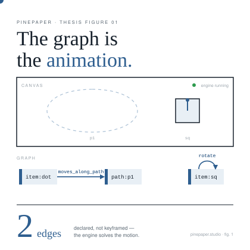
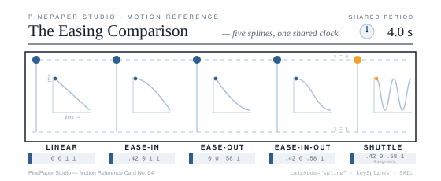
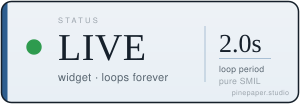

# PinePaper MCP 服务器

> 通过 Model Context Protocol，让 AI 创作矢量动画图形

[English](README.md) · **简体中文** · [日本語](README.ja.md) · [한국어](README.ko.md) · [Español](README.es.md) · [Português (BR)](README.pt-BR.md) · [Français](README.fr.md) · [Deutsch](README.de.md) · [हिन्दी](README.hi.md)

<p align="center">
  
</p>

*上面的横幅是动画 SVG——由 PinePaper 工具调用直接导出，没有视频、没有 GIF。在 GitHub 上打开本页即可看到动效。*

## 概述

PinePaper MCP 服务器让 AI 助手通过 MCP 协议在 [PinePaper Studio](https://pinepaper.studio) 中创建和驱动图形动画。兼容任何支持 MCP 工具调用的 AI（Claude、GPT、Gemini、本地模型等）。

服务器提供 **144 个工具**，覆盖绘图、动画、图表、地图、排版、物理、图像编辑、数据可视化与导出：

- 创建文本、形状、几何图形与复杂图稿
- 用行为驱动的**关系（relations）**做动画，而不是逐帧关键帧
- 程序化背景与参数方程路径
- 图表、地图、流程图与字母拼贴
- 图像编辑：裁剪、绿幕抠像、GPU 滤镜、套索抠图、对象检测
- 导出动画 SVG、视频帧、可嵌入组件与 LLM 训练数据

## 快速开始

```bash
npm install -g @pinepaper.studio/mcp-server
```

**Claude Desktop**（`claude_desktop_config.json`）：

```json
{
  "mcpServers": {
    "pinepaper": {
      "command": "npx",
      "args": ["-y", "@pinepaper.studio/mcp-server"]
    }
  }
}
```

试试对 AI 说：

> “创建一个红色的、带脉冲动画的 HELLO 文字”

> “创建太阳和地球，让地球绕太阳转”

> “加一个蓝紫色的放射状背景”

<p align="center">
  
  
  
</p>

## 1.6.0 新特性

- **图像编辑工具**：`pinepaper_crop_image`（一步裁剪，保留元素 id 与关系）、`pinepaper_chroma_key`（绿幕抠像，阈值自动估计）
- **`pinepaper_media` 新增 `set_clip`** —— 对已上传的视频/音频重新裁剪时长
- **着色器光效**：`pinepaper_apply_effect` 支持 `heatmap`、`liquid_metal`、`gem_smoke`
- **`pinepaper_image_filter` 修复并扩充** —— 直连真实 GPU 滤镜引擎，完整 15 种滤镜（半调家族、色调分离、暗角、HSL、抖动等）
- **README 成为 MCP 资源** —— 客户端可直接读取 `pinepaper://docs/readme`（含多语言变体）

## 本地运行或托管

**本地运行免费且功能完整。** 只要你自己运行这个服务器，所有工具都可用，
没有功能缩水的版本。

需要：Node 18 或更高版本、约 **320 MB** 磁盘空间（Puppeteer 会下载 Chrome），
以及任务运行期间约 1 GB 内存。笔记本电脑没问题，小型 VPS 或受限的办公电脑
则未必。

**[cloud.pinepaper.studio](https://cloud.pinepaper.studio) 替你运行同一个
服务器** —— 相同的工具、相同的版本，通过 HTTP 提供，无需安装，也不需要在你的
机器上运行浏览器。

托管需要成本，因此是付费的，按额度（credits）计费。当前价格请见
[cloud.pinepaper.studio](https://cloud.pinepaper.studio)。如果你能在本地运行，
就在本地运行 —— 这样不会损失任何功能。

## 更多

完整的工具参考、工具包（toolkit）与令牌预算、关系类型列表等，请见 [英文版 README](README.md)。文档也可以在 MCP 协议内读取：资源 `pinepaper://docs/agent-guide` 是为 AI 代理准备的规范工作流。

MIT 许可证 · [pinepaper.studio](https://pinepaper.studio)
